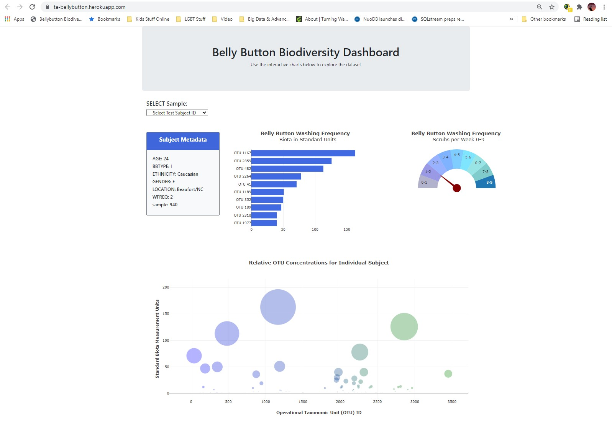

**Bellybutton Biodiversity**

Built a JavaScript interactive dashboard to splunk the [Belly Button
Biodiversity
dataset](http://robdunnlab.com/projects/belly-button-biodiversity/), which
catalogs the microbes that colonize human navels. Serve up the data from
samples.json via a Flask endpoint. Used Bootstrap, D3, and Plotly libraries.
Hosted on Heroku. The dataset reveals that a small handful of microbial species
(also called operational taxonomic units, or OTUs, in the study) were present in
more than 70% of people, while the rest were relatively rare.

**About the Data**

Hulcr, J. et al.(2012) *A Jungle in There: Bacteria in Belly Buttons are Highly
Diverse, but Predictable*. Retrieved from:
<http://robdunnlab.com/projects/belly-button-biodiversity/results-and-data/>
